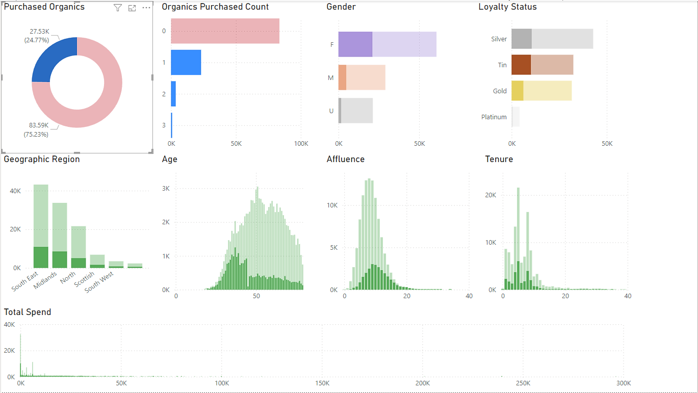
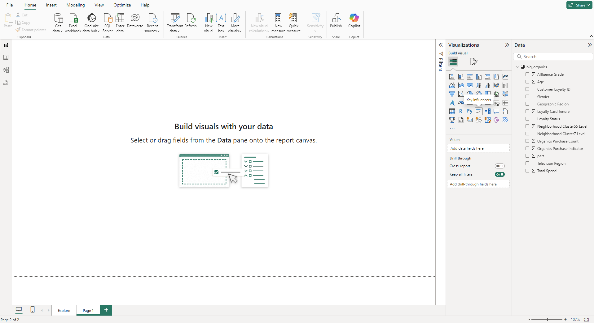

# **Hands-On MS Power BI**
## **Case Study: Big Organics**
### Description
A supermarket has a customer loyalty program and is offering a new line of organic products. As an initial
buyer incentive plan, the supermarket provided coupons for the organic products to all the loyalty
program participants and collected data that include whether these customers have purchased any of the
organic products. The supermarket’s management wants to determine which customers are likely to
purchase these organic products.
### Data
The Big Organics data set contains 13 variables and 111,115 observations.
| Name | Type | Class | Description |
| --- | --- | --- | --- |
|Affluence Grade | Numeric | Measure |Affluence Grade is a grade measured on a scale from 1 to 34|
|Age |Numeric |Measure |Age is the age in years|
|Customer Loyalty ID |Character |Category| Customer Loyalty Identification number|
|Gender |Character |Category |Customer gender (M = male, F = female, U = unknown)|
|Geographic Region |Character |Category |Geographic Region (5 regions in UK: South East, South West, Midlands, North, Scottish)|
|Loyalty Card Tenure |Numeric |Measure |Loyalty Card Tenure is the time as a loyalty card member (in months: 0-39)|
|Loyalty Status |Character |Category |Status of the loyalty card (Tin, Silver, Gold, Platinum)|
|Neighborhood Cluster55 Level |Character |Category |Micro segment of the neighborhood - externally acquired|
|Neighborhood Cluster7 Level |Character |Category |Macro segment of the neighborhood - externally acquired|
|Organics Purchase Count |Numeric |Measure |TARGET (discrete) - Number of Organic Products Purchased|
|Organics Purchase Indicator |Numeric |Measure |TARGET (binary) - Organic Products Purchased? (1 = yes, 0 = no)|
|Television Region |Character |Category |Regional TV broadcasting (see details in this link)|
|Total Spend |Numeric |Measure |Total amount spent (previously)|

### Goals
* Explore the data.
* Build predictive models to determine customers who most likely will buy organic products.

### Power BI
Power BI is a collection of software services, apps, and connectors that work together to turn your unrelated sources of data into coherent, visually immersive, and interactive insights. Power BI lets you easily connect to your data sources, visualize and discover what's important, and share that with anyone or everyone you want.
For this Case Study I'm using Power BI Desktop a Windows desktop application.

#### Open and Connect to the Data
Open Power BI and click on "Blank report".

Select "Get Data From Another Source ->".

Select TXT/CSV and click Connect

Select the big_organics.csv file. And Open.

Check if everything is fine and click Load.

Go to Table View, so we can adapt the table adjusting the variable names.

On DATA, take the first variable DemAffl, click on ... and click on Rename.

Rename all the the variables accordingly, to look like this:

Change the Summarization for the variable Customer Loyalty ID.

Select Organics Purchase Indicator and change its Data type to Text.

Now it is a good time to save it. On the top menu click on File, and Save as (where you want to save it, with the name you want), I saved as BigOrganics. 

Then go back to the Report view, by clicking on the little bar chart on the side menu.

Let's create our first chart, a Donut Chart. On the Visualizations, click on Donut Chart.

Select Customer Loyalty ID as Values and Organics Purchase Indicator as Details.

On Visualizations, use Format visual to adjust the chart as you desire, for example:

Now let's add a Bar Chart to analyse the Purchase Counts.

Again, feel free to use Format visual to adjust the chart as you desire, for example:

Now, create a Bar Chart to analyse Gender and adjust the formats, for example:

Similarly, create 2 more Bar Charts to analyse Loyalty Status and Geographic Region, and adjust the formats, for example:

Additionaly, create 4 Histograms to analyse Age, Affluence, Tenure and Total Spend.
You can use Bar Charts for this. Example:

Before we proceed, notice that on Gender we have the values: F (female), M (male), U (Unknow) and blank. Let's treat this and replace the blanks as U.
Click on Home, Transform data, Transform data.

On the Table select Gender and with the right mouse buttom click and click on Replace Values.

Replace the blanks with U.

Then, click Close & Apply.

Now, using this report, try to understand the factors influencing the Organics Purchase. You can select the values on the Donut Chart and verify how the other charts change.

Rename this Page to something meaninful, e.g.: Explore. And click on + to add a new page.

In Power BI, there is a better way to find what is influencing the Organics purchases.
The key influencers visual helps you identify the factors that impact a metric of interest. It analyzes your data, prioritizes the most significant factors, and presents them as key influencers.

On the new page, click on the Key influencers visual.

Analyse: Organic Purchase Indicator, and Explain by: Affluence Grade,Age, Gender, Loyalty Card Tenure and Loyalty Status. Set all summarizations in the Explain by as Don't Summarize. On What Influences Organics Purchase Indicator to be, select 1.

Clearly, the Gender is top influencer for purchasing Organics products, Females buy 2.9 times more than the others.
Check also the other influencers by clinking on them.

Also check the main influencers for not buying. On What Influences Organics Purchase Indicator to be, select 0.

